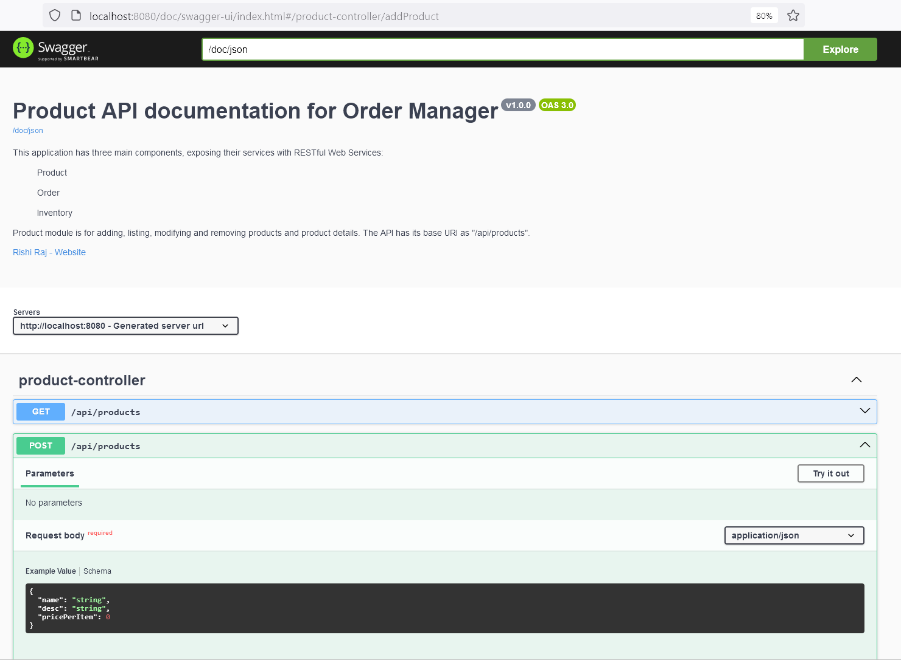
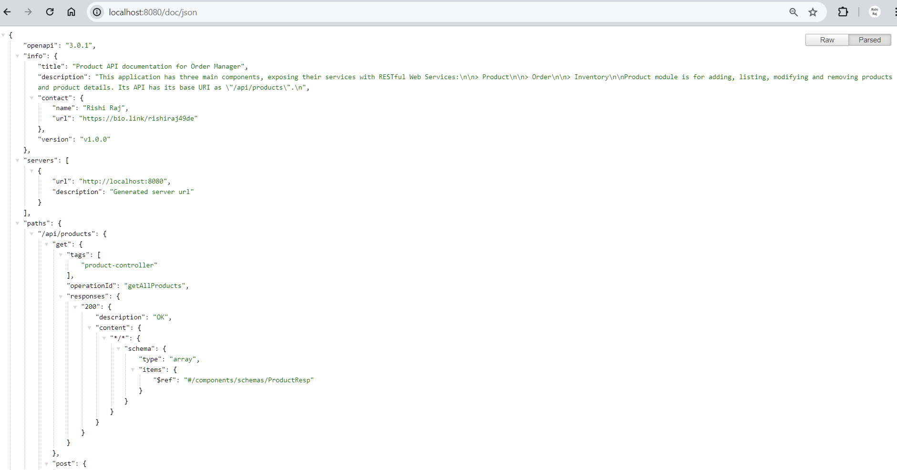
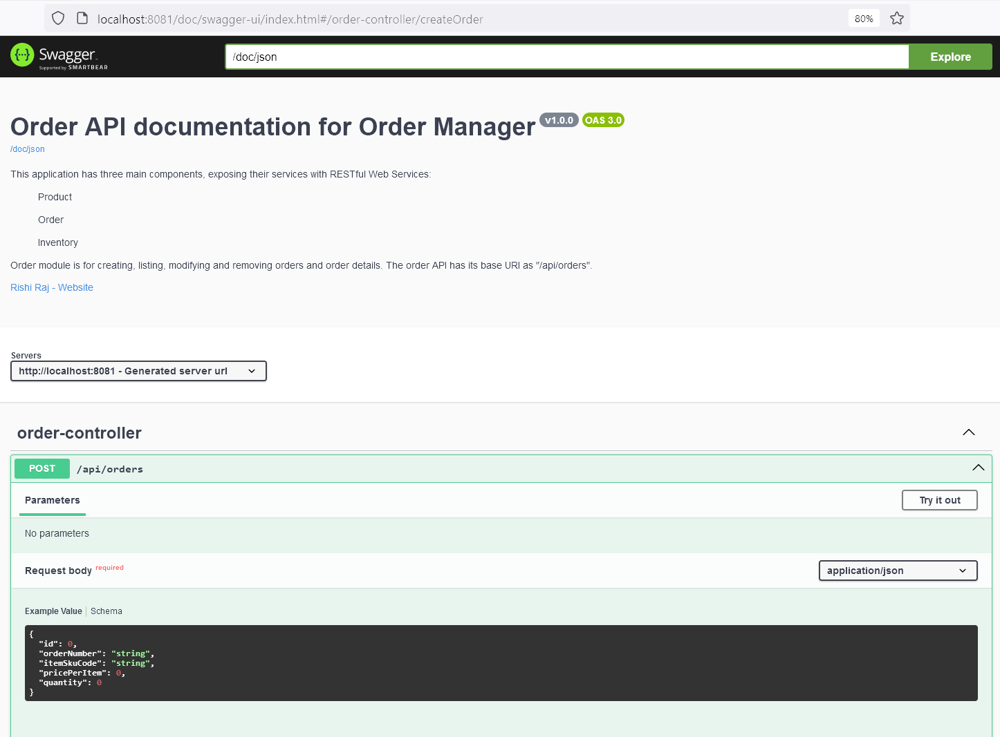
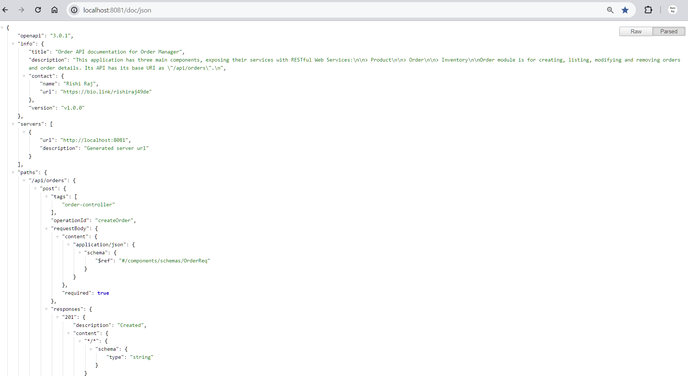
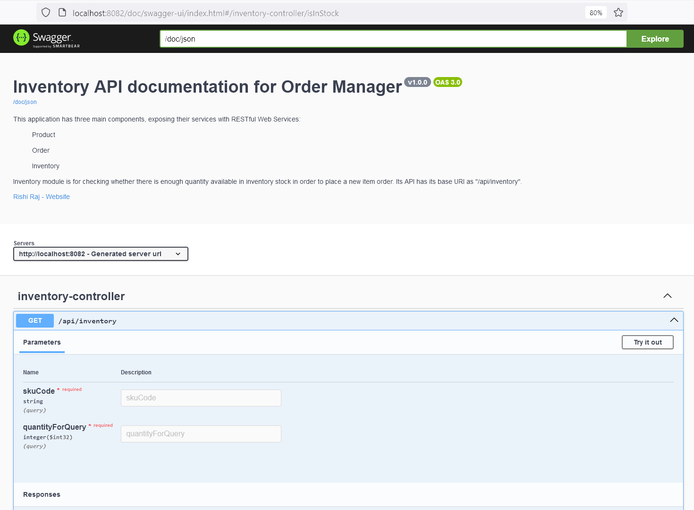
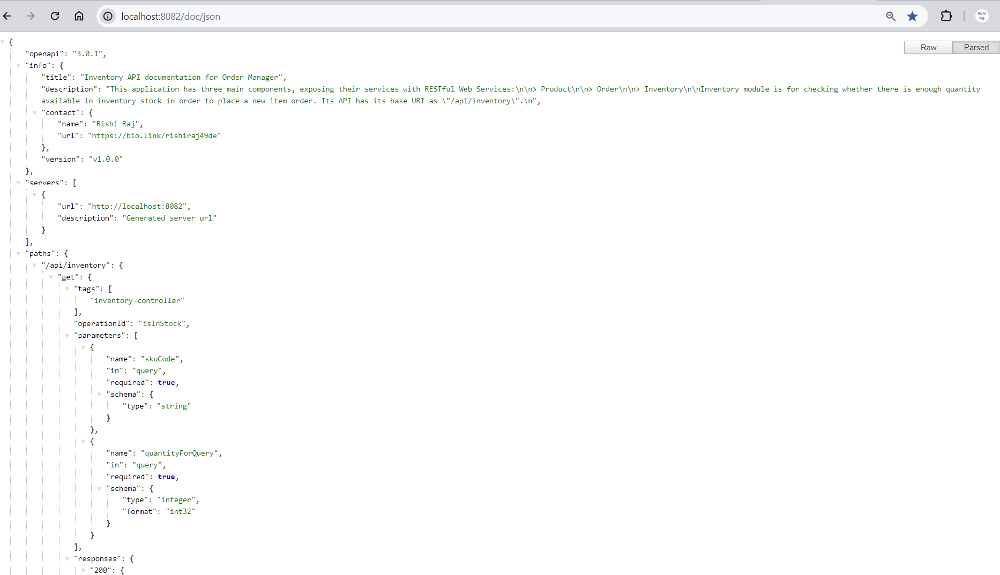

# API Documentation
The documentation of Application Programming Interface of Order Manager is accessible at:
- **Product API Doc (HTML format):** <http://localhost:8080/doc/webui>

- **Product API Doc (JSON format):** <http://localhost:8080/doc/json>

- **Order API Doc (HTML format):** <http://localhost:8081/doc/webui>

- **Order API Doc (JSON format):** <http://localhost:8081/doc/json>

- **Inventory API Doc (HTML format):** <http://localhost:8082/doc/webui>

- **Inventory API Doc (JSON format):** <http://localhost:8082/doc/json>

## Contact Pointers
- **LinkedIn:** <https://www.linkedin.com/in/rishirajopenminds>
- **X:** <https://twitter.com/RishiRajDevOps>
- **Start Page:** <https://bio.link/rishiraj49de>
- **GitHub:** <https://github.com/rishiraj88>

## Credits and Gratitude
I thank all who have mentored, taught and guided me. Also, I appreciate who have supported my work with pair programming etc.
