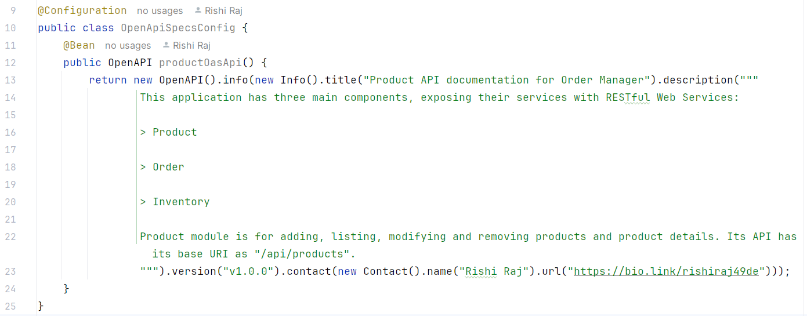

# API Documentation
The documentation of Application Programming Interface of Order Manager is accessible at:
- **Product API Doc (HTML format):** <http://localhost:8080/doc/webui>

- **Product API Doc (JSON format):** <http://localhost:8080/doc/json>

- **Order API Doc (HTML format):** <http://localhost:8081/doc/webui>

- **Order API Doc (JSON format):** <http://localhost:8081/doc/json>

- **Inventory API Doc (HTML format):** <http://localhost:8082/doc/webui>

- **Inventory API Doc (JSON format):** <http://localhost:8082/doc/json>

## Setup
Setup for generating API documentation for Product module is illustrated below. Similar steps for Order and Inventory modules offer consistent results.

- Add the following dependencies in `pom-xml` (or in respective format in `build.gradle.kts`/`build.gradle`):
`
        <dependency>
            <groupId>org.springdoc</groupId>
            <artifactId>springdoc-openapi-starter-webmvc-ui</artifactId>
            <version>2.5.0</version>
        </dependency>
        <dependency>
            <groupId>org.springdoc</groupId>
            <artifactId>springdoc-openapi-starter-webmvc-api</artifactId>
            <version>2.5.0</version>
        </dependency>
`

- In `application.properties` under `src/main/resources`, add the following two resources (kea-value pairs):
<pre>
springdoc.swagger-ui.path=/doc/webui
springdoc.api-docs.path=/doc/json
</pre>
The first pair above is to view the API documentation in HTML format (web-based GUI). And, the second one is to access the API doc in JSON format; this response of this service endpoint is so versatile that it can be fed for consumption into any REST client as well as read easily by humans.

- Lastly, create this configuration file (Java class or equivalent in another JVM language) in classpath- `OpenApiSpecsConfig`:

- Then add the code (Java code has been added, feel free to switch to Kotlin if you prefer!).

### Manual Testing and Operation, along with Keycloak Configuration
- Now sit back tight and do the dirty engineering on service endpoints, integration and parameter matching.

- Run `docker-compose up -d` out of Product, Order and Inventory services.
- Start (Run.../Debug...) Product, Order, Inventory and Gateway services with IDE or CLI.
- Hit Product service over the port of Gateway. You succeed to access the service endpoint:

## Contact Pointers
- **LinkedIn:** <https://www.linkedin.com/in/rishirajopenminds>
- **X:** <https://twitter.com/RishiRajDevOps>
- **Start Page:** <https://bio.link/rishiraj49de>
- **GitHub:** <https://github.com/rishiraj88>

## Credits and Gratitude
I thank all who have mentored, taught and guided me. Also, I appreciate who have supported my work with pair programming and more.
