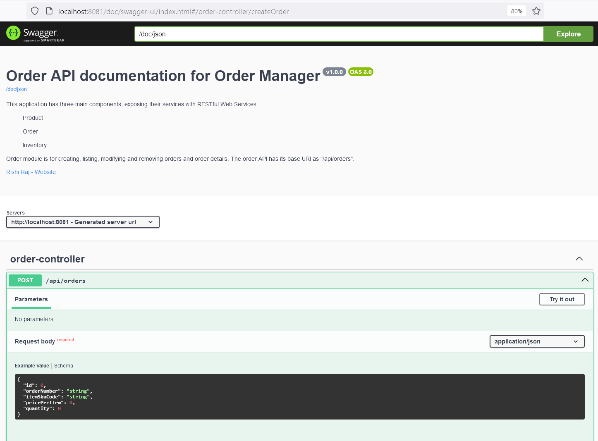
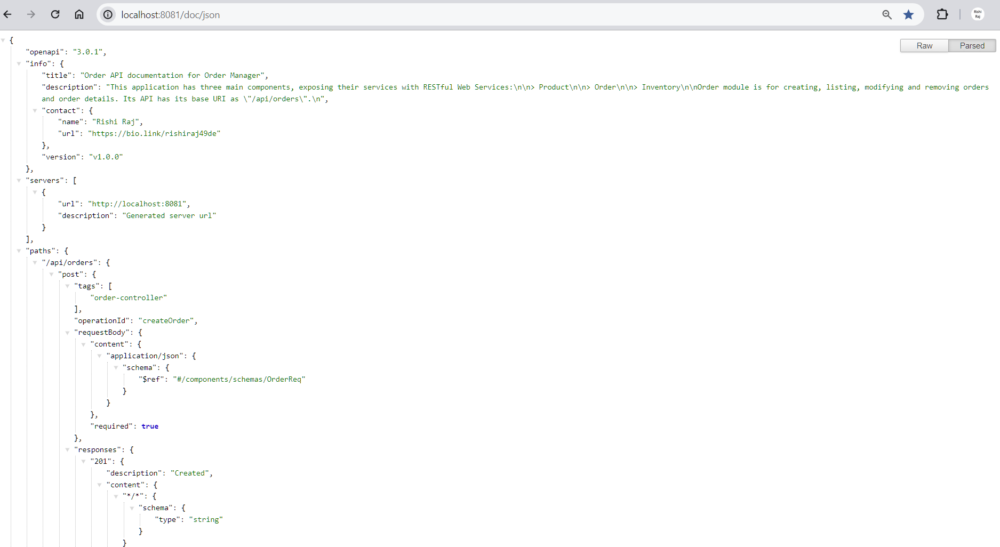
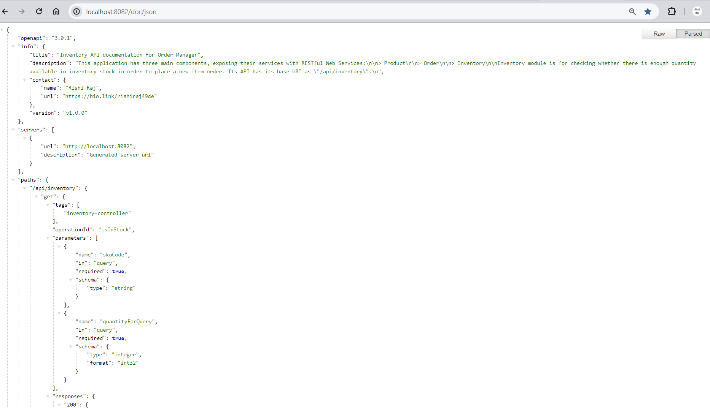

# Kubernetes Deployment Notes

rishi@ssgamer MINGW64 ~/mygithubprojs/order-manager/k8sclusteryml/V2kotlin (develop)
$ kubectl apply -f orderdb-deployment.yml
Warning: resource persistentvolumes/orderdbpv is missing the kubectl.kubernetes.io/last-applied-configuration annotation which is required by kubectl apply. kubectl apply should only be used on resources created declaratively by either kubectl create --save-config or kubectl apply. The missing annotation will be patched automatically.
persistentvolume/orderdbpv configured
Warning: resource persistentvolumeclaims/orderdbpv is missing the kubectl.kubernetes.io/last-applied-configuration annotation which is required by kubectl apply. kubectl apply should only be used on resources created declaratively by either kubectl create --save-config or kubectl apply. The missing annotation will be patched automatically.
persistentvolumeclaim/orderdbpv configured
Warning: resource deployments/om-orderdb-depl is missing the kubectl.kubernetes.io/last-applied-configuration annotation which is required by kubectl apply. kubectl apply should only be used on resources created declaratively by either kubectl create --save-config or kubectl apply. The missing annotation will be patched automatically.
deployment.apps/om-orderdb-depl configured

rishi@ssgamer MINGW64 ~/mygithubprojs/order-manager/k8sclusteryml/V2kotlin (develop)
$ kubectl get deployment
NAME              READY   UP-TO-DATE   AVAILABLE   AGE
om-orderdb-depl   0/1     1            0           2m37s

rishi@ssgamer MINGW64 ~/mygithubprojs/order-manager/k8sclusteryml/V2kotlin (develop)
$ kubectl get deployment,svc
NAME                              READY   UP-TO-DATE   AVAILABLE   AGE
deployment.apps/om-orderdb-depl   0/1     1            0           2m49s

NAME                 TYPE        CLUSTER-IP   EXTERNAL-IP   PORT(S)   AGE
service/kubernetes   ClusterIP   10.96.0.1    <none>        443/TCP   2d19h

rishi@ssgamer MINGW64 ~/mygithubprojs/order-manager/k8sclusteryml/V2kotlin (develop)
$ kubectl orderdb-service.yml
error: unknown command "orderdb-service.yml" for "kubectl"

rishi@ssgamer MINGW64 ~/mygithubprojs/order-manager/k8sclusteryml/V2kotlin (develop)
$ kubectl create -f orderdb-service.yml
service/om-orderdb created

rishi@ssgamer MINGW64 ~/mygithubprojs/order-manager/k8sclusteryml/V2kotlin (develop)
$ kubectl create -f order-deployment.yml
deployment.apps/om-order-depl created

rishi@ssgamer MINGW64 ~/mygithubprojs/order-manager/k8sclusteryml/V2kotlin (develop)
$ kubectl create -f order-service.yml
service/om-order created

rishi@ssgamer MINGW64 ~/mygithubprojs/order-manager/k8sclusteryml/V2kotlin (develop)
$ kubectl get deployment,svc
NAME                              READY   UP-TO-DATE   AVAILABLE   AGE
deployment.apps/om-order-depl     0/1     1            0           2m10s
deployment.apps/om-orderdb-depl   0/1     1            0           9m1s

NAME                 TYPE        CLUSTER-IP       EXTERNAL-IP   PORT(S)          AGE
service/kubernetes   ClusterIP   10.96.0.1        <none>        443/TCP          2d19h
service/om-order     NodePort    10.96.23.60      <none>        8080:32080/TCP   107s
service/om-orderdb   ClusterIP   10.101.190.110   <none>        3306/TCP         4m39s

rishi@ssgamer MINGW64 ~/mygithubprojs/order-manager/k8sclusteryml/V2kotlin (develop)
$

----------------------------------------------

The documentation of Application Programming Interface of Order Manager is accessible at:
- **Product API Doc (HTML format):** <http://localhost:8080/doc/webui>

- **Product API Doc (JSON format):** <http://localhost:8080/doc/json>

- **Order API Doc (HTML format):** <http://localhost:8081/doc/webui>

- **Order API Doc (JSON format):** <http://localhost:8081/doc/json>

- **Inventory API Doc (HTML format):** <http://localhost:8082/doc/webui>

- **Inventory API Doc (JSON format):** <http://localhost:8082/doc/json>

## Setup
Setup for generating API documentation for Product module is illustrated below. Similar steps for Order and Inventory modules offer consistent results.

- Add the following dependencies in `pom-xml` (or in respective format in `build.gradle.kts`/`build.gradle`):

- In `application.properties` under `src/main/resources`, add the following two resources (kea-value pairs):
<pre>
springdoc.swagger-ui.path=/doc/webui
springdoc.api-docs.path=/doc/json
</pre>
The first pair above is to view the API documentation in HTML format (web-based GUI). And, the second one is to access the API doc in JSON format; this response of this service endpoint is so versatile that it can be fed for consumption into any REST client as well as read easily by humans.

- Lastly, create this configuration file (Java class or equivalent in another JVM language) in classpath- `OpenApiSpecsConfig`:

- Then add the code (Java code has been added, feel free to switch to Kotlin if you prefer!).

### Manual Testing and Operation, along with Keycloak Configuration
- Now sit back tight and do the dirty engineering on service endpoints, integration and parameter matching.

- Run `docker-compose up -d` out of Product, Order and Inventory services.
- Start (Run.../Debug...) Product, Order, Inventory and Gateway services with IDE or CLI.
- Hit Product service over the port of Gateway. You succeed to access the service endpoint:

## Contact Pointers
- **LinkedIn:** <https://www.linkedin.com/in/rishirajopenminds>
- **X:** <https://twitter.com/RishiRajDevOps>
- **Start Page:** <https://bio.link/rishiraj49de>
- **GitHub:** <https://github.com/rishiraj88>

## Credits and Gratitude
I thank all who have mentored, taught and guided me. Also, I appreciate who have supported my work with pair programming and more.
