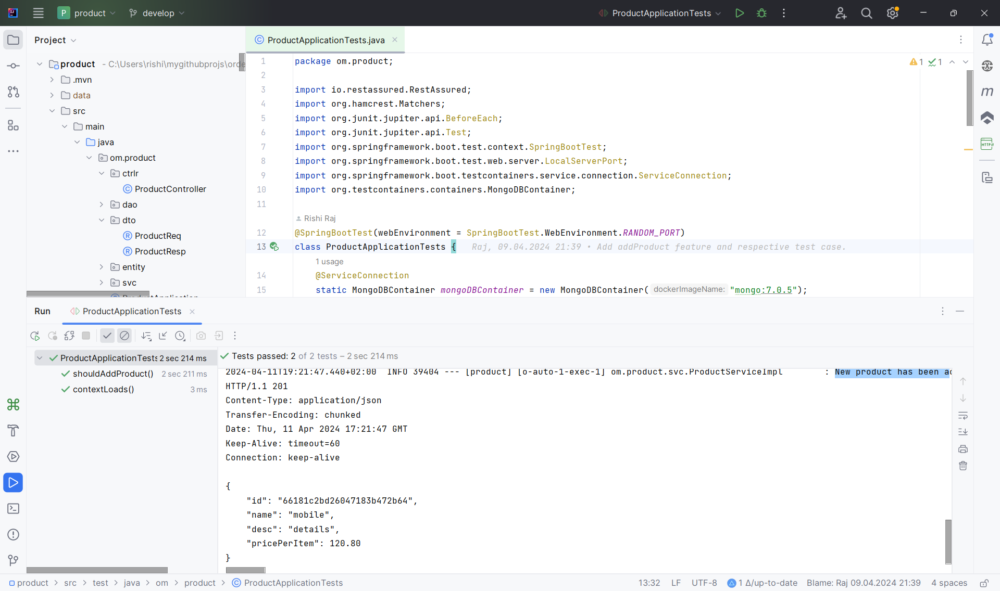
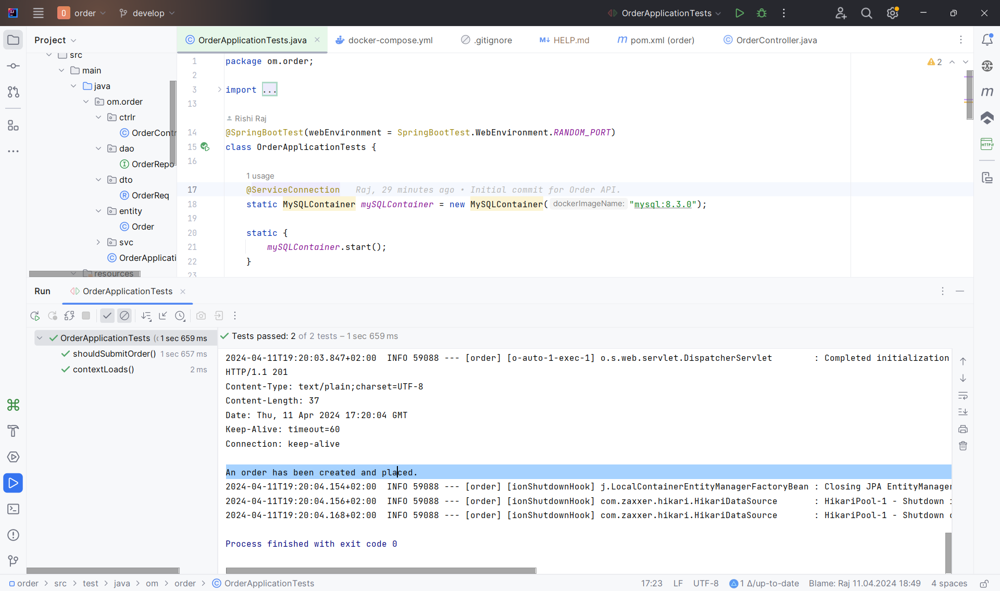
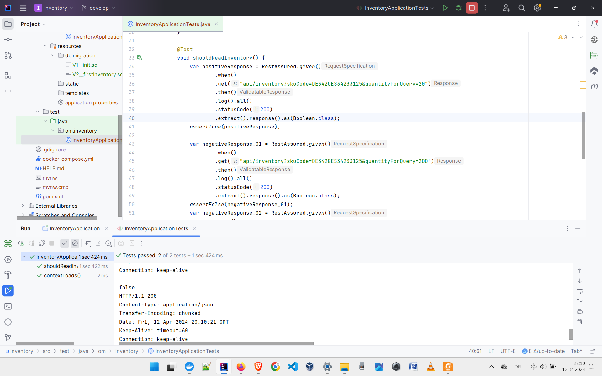

# Order Manager (order-manager)
Order management APIs, built with Spring Boot

## General Note
I enjoy the following approach for inception, enhancement and fortification of projects:
1. Start in simple, lazy and less structured approach.
2. Modularise, distribute and containerise various components as needed.
3. Look out for fan-out scenarios and got for asynchronous messaging across services.
Suggestions and feedback comments from readers are always welcomed with love.

## Modules
- Product
- Order
- Inventory
- More may be added on need basis.

## Product Module
This module is for adding, listing, modifying and removing products and product details.

### API Base
The product API has its base at "/api/products".

### Database Details
MongoDB engine powers the product module. The data store is well expected to be enriched with newer fields very frequently, so NoSQL database technology is used for this.
The database is deployed in a Docker container with a persistent volume to hold business data.

### Project Setup with Dependencies
The module for Product has been set up with the following dependencies, specified in Spring Init:
- Lombok
- Spring Web
- Spring Data MongoDB
- Testcontainers
- Rest-Assured

### Testing

### Manual Testing

#### Automated Testing
A number of test cases are already provided in the **Tests** class. For POST request to add one new product, the following JSON-formatted data can be used to formulate request body:
<pre>{
"name":"mobile", 
"desc":"details", 
"pricePerItem":120.80
}</pre>

## Order Module
This module is for creating, listing, modifying and removing orders and order details.

### API Base
The order API has its base at "/api/orders".

### Database Details
MySQL engine powers the order module. The data store is expected to be structured with infrequent field additions, modifications and removals. So, SQL database (RDBMS) technology is used for this.
The database is deployed in a Docker container with a persistent volume to hold business data.

### Project Setup with Dependencies
The module for Product has been set up with the following dependencies, specified in Spring Init:
- Lombok
- Spring Web
- Spring Data MySQL
- Testcontainers
- Rest-Assured

### Testing

### Manual Testing

#### Automated Testing
A number of test cases are already provided in the **Tests** class. For POST request to create one new order, the following JSON-formatted data can be used to formulate request body:
<pre>{
"orderNumber":"DE3343INT432342342345", 
"itemSkuCode":"DE342GES34233234", 
"pricePerItem":120.80,
"quantity":2
}</pre>

## Inventroy Module
This module is for checking whether there is enough quantity available in inventory stock in order to place a new item order.

### API Base
The inventory API has its base at "/api/inventory".

### Database Details
MySQL engine powers the inventory module. The data store is expected to be structured with infrequent field additions, modifications and removals. So, SQL database (RDBMS) technology is used for this.
The database is deployed in a Docker container with a persistent volume to hold business data.

### Project Setup with Dependencies
The module for Product has been set up with the following dependencies, specified in Spring Init (<https://start.spring.io/>):
- Lombok
- Spring Web
- Spring Data MySQL
- Testcontainers
- Rest-Assured

### Testing

#### Manual Testing

For GET request to check the in-stock availability of an item, the following URL pattern can be prepared and hit:
<pre>http://localhost:8082/api/inventory?skuCode=DE342GES34233125&quantityForQuery=200</pre>

#### Positive Test Scenario

#### Negative Test Scenario 01

#### Negative Test Scenario 02

#### Automated Testing

## Contact Pointers
- **LinkedIn:** <https://www.linkedin.com/in/rishirajopenminds>
- **X:** <https://twitter.com/RishiRajDevOps>
- **Start Page:** <https://bio.link/rishiraj49de>
- **GitHub:** <https://github.com/rishiraj88>

## Credits and Gratitude
I thank all who have mentored, taught and guided me. Also, I appreciate who have supported my work with pair programming etc.
