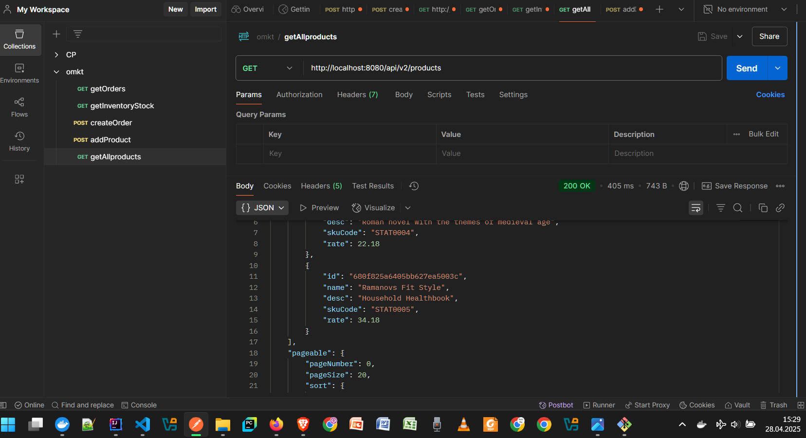
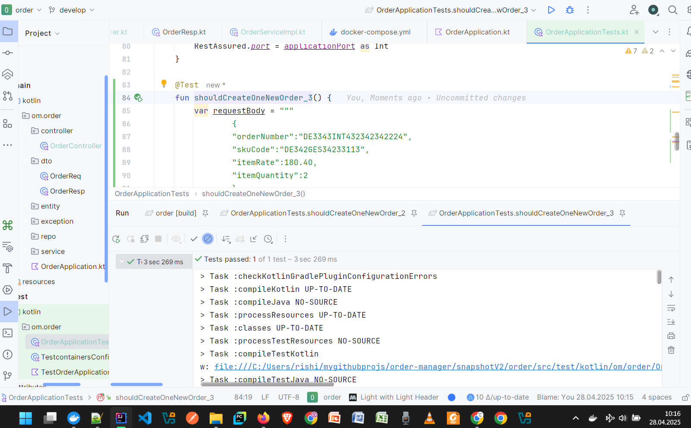

# Order Manager (a POC on Modern "Development Best Practices")
- This project does not have a fool-proof implementation of order module of any modern e-commerce platform, rather it showcases how the problems faced by most of the businesses today can be simply managed with a "distributed app" approach. Such a system is implemented using modern web technologies, knitted with asynchronous and synchronous communications and further empowered with Observability. Thanks for Prometheus-Grafana stack, which consists of loggging tools (Loki), Distributed Tracing tools (micrometer) and Dashboarding powerhouse (Grafana).

- Some of the technologies and developer tools used in this project are:
- Spring Boot 3.4, Java 21+ (Java 24)
- Keycloak (OAuth2, OpenID Connect) for User Account management, Authorization and Authentication [*Reference Doc*](https://github.com/rishiraj88/order-manager/blob/main/gateway%20implementation%20with%20Keycloak.md)
- Prometheus-Grafana stack for Observability (Prometheus, Loki, micrometer and Grafana  Dashboard)
- Modern strategy for Spring Security implementation (as in Spring Boot 3, Spring 6)
- Use of WebClient and RestClient (Spring Boot 3) and not of FeignClient (Spring Boot 2.7 style)
- Apache Kafka for for message queues (MQ), which provide for asynchronous communication (as in Notification) across web services
- Docker-Compose for containerization of apps
- Testcontainers for automated API Testing and wiremock for Contract Testing, along with Rest-Assured
- Container orchestration, clustering and auto-scaling with Deployment YAML for Kubernetes.
- Port exposure with Service kind of descriptors (Kubernetes)

## Highlights of technological tools
- Prometheus-Grafana stack for Observability (Prometheus, Grafa-Loki, micrometer)
- Multi-stage Dockerfile for smaller container sizes and enhanced security of business apps
- Declarations of YAML for Kubernetes-based cluster deployment
- Gateway implementation as a microservice to secure and connect the backend APIs to external clients

## Development Style for the Big Distributed Platform:
The distributed platform, a technological giant, is being developed and enhanced continuously in two main streams:
- `archiV1java`: using Java/Jakarta with Spring Boot 3 as main development toolset. It gets the first chance and higher priority to try more and newer technological frameworks, libraries and performance enhancers out. Think of Fedora and Rocky Linux here.
- `snapshotV2kotlin`: using Kotlin with Spring Boot 3 as main development stack. It inherits the tried-and-tested tooling from *archiV1java* stream.

## This application has three main business components, implemented as Microservices:
As three RESTful APIs, these business components interact with one another:
- Product
- Order
- Inventory

## More components, services, config and connectors are there as well- 
- to integrate the three main actors (our "heroes"), and
- Gateway and User Authentication with OpenID Connect (Keykloak: <./gateway/README.md>)
- API Documentation with OpenAPI Specification (OAS): Swagger
- Message queues in order to facilitate smooth communication among the services.

And the result is: unmatched and flawless user experience. :) 

## A few exciting screenshots (updated in May 2025)

## To view and test-run the web app

### When without Deployment
- to list pods and services
<pre>$ kubectl get pods,svc</pre>

- to get the URL of Order app.
<pre>$ minikube service om-order-svc --url</pre>

### When with Deployment
- to list deployments and services
<pre>$ kubectl get deployments,svc</pre>

- to get the URL of Order app.
<pre>$ minikube service om-order-svc --url</pre>

### Similar steps for Product app with Deployment
- to list deployments and services
<pre>$ kubectl get deployments,svc</pre>

- to get the URL of Product app.
<pre>$ minikube service om-product-svc --url</pre>

## Scale the services
<pre>kubectl scale deployment om-order-depl --replicas=2</pre>
<pre>kubectl scale deployment om-product-depl --replicas=2</pre>

Documentation is being updated for the year 2025. However, the screenshots of the year 2024 are quite convincing and "in context".

## Tech Tools Used for Development
- Spring Boot, with Spring Web
- Spring Cloud Config (for service integration)
- Spring Security (for Authz-n-Authn)
- Keycloak (for user account management)
- MongoDB (NoSQL Database)
- Spring Data MongoDB (for Mongo Repository)
- MySQL (Relational Database System)
- Spring Data MySQL (for JPA Repository)
- Flyway (for Database Migration)
- Docker-Compose (for containerization)
- Local container repo registry (registry image from Docker Hub)
- Swagger (for OpenAPI-based API documentation)
- Testcontainers (for Test Automation with stubs)
- Rest-Assured (for Testing and Validation)
- Lombok (for boilerplate code injection)
- Spring RestClient (Spring Boot 3.2 offering. It replaces the older option Spring OpenFeign (for inter-service communication))
- Resilient4j v2 for Fault Tolerance

## General Note on Development Style
I enjoy the following approach for inception, enhancement and fortification of projects:
1. Start in simple, lazy and less structured approach.
2. Modularise, distribute and containerise various components, guided by relative prioritization.
3. Look out for fan-out scenarios and go for asynchronous messaging across services accordingly.
4. Alongside work, in gradual steps, towards making the deliverables (distributables) compact in file size and deploy them in replicas (clusters).

Suggestions and feedback comments from readers are always welcomed with love. Some screenshots from one session on cluster management and orchestration are here:
- 
- 
- 
- 
- 
- 
- 
- 
- 
- 

## Modules
- Product
- Order
- Inventory
- Gateway (with redirection, and OAuth2 with Keycloak and Docker-Compose)
- More may be added on need basis.

## Product Module
This module is for adding, listing, modifying and removing products and product details.

### API Base
The product API has its base at "/api/v1/products".

### Database Details
MongoDB engine powers the product module. The data store is well expected to be enriched with newer fields very frequently, so NoSQL database technology is used for this.
The database is deployed in a Docker container with a persistent volume to hold business data.

### Project Setup with Dependencies
The module for Product (Kotlin variant) has been set up with the following dependencies, specified in Spring Init:
- Spring Web
- Spring Data MongoDB
- Testcontainers
- Rest-Assured
- Swagger (for OpenAPI-based API documentation)

### Testing

### Manual Testing

#### Testing Screenshots [20250903]

#### Product

#### Order

#### Inventory

#### Automated Testing
A number of test cases are already provided in the **Tests** class. For POST request to add one new product, the following JSON-formatted data can be used to formulate request body:
<pre>{
"name":"mobile", 
"desc":"details", 
"pricePerItem":120.80
}</pre>

#### Product testing in Apr-2025

#### Order testing in Apr-2025

#### Testing Done in Apr-2024

#### Testing Done in May-2024

## Order Module
This module is for creating, listing, modifying and removing orders and order details.

### API Base
The order API has its base at "/api/v1/orders".

### Database Details
MySQL engine powers the order module. The data store is expected to be structured with infrequent field additions, modifications and removals. So, SQL database (RDBMS) technology is used for this.
The database is deployed in a Docker container with a persistent volume to hold business data.

### Steps to set local image repository registry up

- Create the registry for local image repositories:
docker run -d -p 5000:5000 --restart=always --name registry registry:3.0.0

Build app images with customer labels:
docker build . -t localhost:5000/om-order

Push the images to the local repository:
docker push localhost:5000/om-order

#### Spring Boot project dependencies (Intial Set)

#### Project dependency added for Wiremock

### Testing

### Manual Testing

#### Automated Testing
A number of test cases are already provided in the **Tests** class. For POST request to create one new order, the following JSON-formatted data can be used to formulate request body:
<pre>{
"orderNumber":"DE3343INT432342342345", 
"itemSkuCode":"DE342GES34233234", 
"pricePerItem":120.80,
"quantity":2
}</pre>

#### Testing Done on 11-Apr-2024

#### Testing Done on 02-May-2024

#### Testing Done on 06-May-2024 with WireMock

- Before Stubbing: Order Request and Positive Scenario Response

- Before Stubbing: Order Request and Negative Scenario Response

- With Stubbing of Inventory API: Response

## Inventroy Module
This module is for checking whether there is enough quantity available in inventory stock in order to place a new item order.

### API Base
The inventory API has its base at "/api/inventory".

### Database Details
MySQL engine powers the inventory module. The data store is expected to be structured with infrequent field additions, modifications and removals. So, SQL database (RDBMS) technology is used for this.
The database is deployed in a Docker container with a persistent volume to hold business data.

### Project Setup with Dependencies
The module for Product has been set up with the following dependencies, specified in Spring Init (<https://start.spring.io/>):
- Lombok
- Spring Web
- Spring Data MySQL
- Flyway
- Testcontainers
- Rest-Assured
- RestClient (Spring Boot 3)
- Swagger (for OpenAPI-based API documentation)

### Testing

#### Manual Testing

For GET request to check the in-stock availability of an item, the following URL pattern can be prepared and hit:
<pre>http://localhost:8082/api/inventory?skuCode=DE342GES34233125&quantityForQuery=200</pre>

#### Positive Test Scenario

#### Negative Test Scenario 01

#### Negative Test Scenario 02

#### Automated Testing

#### Testing Done on 11-Apr-2024

## Gateway Module
This module is for accepting the requests for external clients in first place and then redirecting them to appropriate microservices, such as:
- _to Product_ to view product list and to add new product to data store;
- _to Order_ to place an order for an item. It internally checks at Inventory service whether the requested quantity for the SKU is available in store (warehouse/shop);
- _one "backend access"_ for development purpose.  

### API Port
The gateway API is served at port `9000` and comes into access when the following URL patterns are hit:
- POST and GET at http://localhost:9000/api/products
- POST at http://localhost:9000/api/orders
- GET at http://localhost:9000/api/inventory?skuCode=DE342GES34233123&quantityForQuery=5

<pre>Examplary values are shown the the inventory URL above.</pre>

### Database Details
MySQL engine powers the user-authorization-and-authentication database. The data store is not accessed by the gateway code directly nor from the wild outside without any authorization check. The open source tool Keycloak is in place to manage user Authz-n-Authn data and very low variation in the data dictionary is expected. So, SQL database (RDBMS) technology is used for this.
Keykloak tool and the database are both deployed in Docker containers with a persistent volumes.

### Project Setup with Dependencies
The module for Product has been set up with the following dependencies, specified in Spring Init (<https://start.spring.io/>):
- Gateway
- OAuth2 Resource Server

### Keycloak Config and Auth Testing
Configuration and manual testing across service endpoint integration are detailed out in the separate Markdown file: - **gateway implementation with Keycloak.md**

### Gists & Developer Notes
- to view tables in mysql database:
<pre>mysql -uusernameyourwish -ppasswordyourwish
show databases;
use leasedb;
show tables;
</pre>
- locally hosted Docker registry has been set up as:
</pre>docker run -d -p 5000:5000 --restart always --name registry registry:2
docker tag imageName localhost:5000/imageName
$ docker push localhost:5000/imageName</pre>

## Contact Pointers
- **LinkedIn:** <https://www.linkedin.com/in/rishirajopenminds>
- **GitHub:** <https://github.com/rishiraj88>
- **X:** <https://twitter.com/RishiRajDevOps>
- **Start Page:** <https://bio.link/rishiraj49de>

## Credits and Gratitude
I thank all who have mentored, taught and guided me. Also, I appreciate who have supported my work with pair programming and more.
