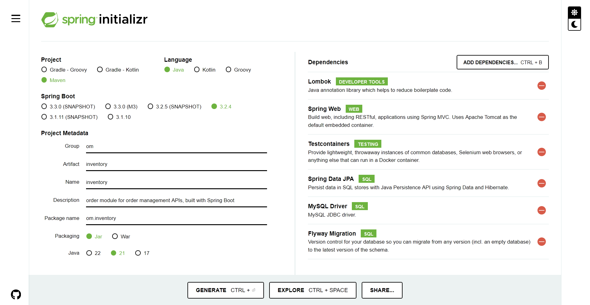
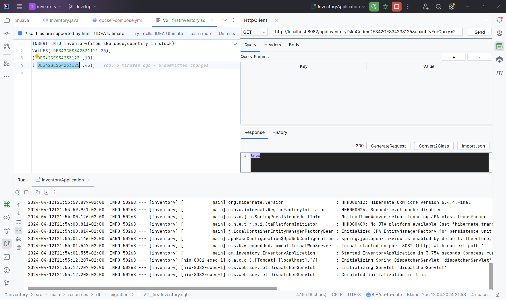

# Order Manager (order-manager)
Order management APIs-
- built with Spring Boot,
- tested with TestContainers!

This application has three main components, exposing their services with RESTful Web Services:
- Product
- Order
- Inventory

More components, services, config and connectors are there as well- 
- to integrate the three main actors (our "heroes"), and
- to facilitate smooth communication among the services.

The end result is: SMOOTHEST customer experience. :) 

## Tech Tools Used for Development
- Spring Boot, with Spring Web
- MongoDB (NoSQL Database)
- Spring Data MongoDB (for Mongo Repository)
- MySQL (Relational Database System)
- Spring Data MySQL (for JPA Repository)
- Flyway (for Database Migration)
- Docker containerization
- Testcontainers (for Test Automation with stubs)
- Rest-Assured (for Testing)
- Lombok (for boilerplate code injection)
- Spring OpenFeign

## General Note
I enjoy the following approach for inception, enhancement and fortification of projects:
1. Start in simple, lazy and less structured approach.
2. Modularise, distribute and containerise various components as needed.
3. Look out for fan-out scenarios and go for asynchronous messaging across services accordingly.
Suggestions and feedback comments from readers are always welcomed with love.

## Modules
- Product
- Order
- Inventory
- Gateway (with redirection, and OAuth2 with Keycloak and Docker-Compose)
- More may be added on need basis.

## Product Module
This module is for adding, listing, modifying and removing products and product details.

### API Base
The product API has its base at "/api/products".

### Database Details
MongoDB engine powers the product module. The data store is well expected to be enriched with newer fields very frequently, so NoSQL database technology is used for this.
The database is deployed in a Docker container with a persistent volume to hold business data.

### Project Setup with Dependencies
The module for Product has been set up with the following dependencies, specified in Spring Init:
- Lombok
- Spring Web
- Spring Data MongoDB
- Testcontainers
- Rest-Assured

### Testing

### Manual Testing

#### Automated Testing
A number of test cases are already provided in the **Tests** class. For POST request to add one new product, the following JSON-formatted data can be used to formulate request body:
<pre>{
"name":"mobile", 
"desc":"details", 
"pricePerItem":120.80
}</pre>

#### Testing Done on 11-Apr-2024

#### Testing Done on 02-May-2024

## Order Module
This module is for creating, listing, modifying and removing orders and order details.

### API Base
The order API has its base at "/api/orders".

### Database Details
MySQL engine powers the order module. The data store is expected to be structured with infrequent field additions, modifications and removals. So, SQL database (RDBMS) technology is used for this.
The database is deployed in a Docker container with a persistent volume to hold business data.

### Project Setup with Dependencies
The module for Product has been set up with the following dependencies, specified in Spring Init:
- Lombok
- Spring Web
- Spring Data MySQL
- Flyway
- Testcontainers
- Rest-Assured
- Spring OpenFeign
- WireMock for using stubs during automated API testing

#### Spring Boot project dependencies (Intial Set)

#### Project dependency added for Wiremock

### Testing

### Manual Testing

#### Automated Testing
A number of test cases are already provided in the **Tests** class. For POST request to create one new order, the following JSON-formatted data can be used to formulate request body:
<pre>{
"orderNumber":"DE3343INT432342342345", 
"itemSkuCode":"DE342GES34233234", 
"pricePerItem":120.80,
"quantity":2
}</pre>

#### Testing Done on 11-Apr-2024

#### Testing Done on 02-May-2024

#### Testing Done on 06-May-2024 with WireMock

- Before Stubbing: Order Request and Positive Scenario Response

- Before Stubbing: Order Request and Negative Scenario Response

- With Stubbing of Inventory API: Response

## Inventroy Module
This module is for checking whether there is enough quantity available in inventory stock in order to place a new item order.

### API Base
The inventory API has its base at "/api/inventory".

### Database Details
MySQL engine powers the inventory module. The data store is expected to be structured with infrequent field additions, modifications and removals. So, SQL database (RDBMS) technology is used for this.
The database is deployed in a Docker container with a persistent volume to hold business data.

### Project Setup with Dependencies
The module for Product has been set up with the following dependencies, specified in Spring Init (<https://start.spring.io/>):
- Lombok
- Spring Web
- Spring Data MySQL
- Flyway
- Testcontainers
- Rest-Assured
- Spring OpenFeign

### Testing

#### Manual Testing

For GET request to check the in-stock availability of an item, the following URL pattern can be prepared and hit:
<pre>http://localhost:8082/api/inventory?skuCode=DE342GES34233125&quantityForQuery=200</pre>

#### Positive Test Scenario

#### Negative Test Scenario 01

#### Negative Test Scenario 02

#### Automated Testing

#### Testing Done on 11-Apr-2024

## Gateway Module
This module is for accepting the requests for external clients in first place and then redirecting them to appropriate microservices, such as:
- _to Product_ to view product list and to add new product to data store;
- _to Order_ to place an order for an item. It internally checks at Inventory service whether the requested quantity for the SKU is available in store (warehouse/shop);
- _one "backend access"_ for development purpose.  

### API Port
The gateway API is served at port `9000` and comes into access when the following URL patterns are hit:
- POST and GET at http://localhost:9000/api/products
- POST at http://localhost:9000/api/orders
- GET at http://localhost:9000/api/inventory?skuCode=DE342GES34233123&quantityForQuery=5

<pre>Examplary values are shown the the inventory URL above.</pre>

### Database Details
MySQL engine powers the user-authorization-and-authentication database. The data store is not accessed by the gateway code directly nor from the wild outside without any authorization check. The open source tool Keycloak is in place to manage user Authz-n-Authn data and very low variation in the data dictionary is expected. So, SQL database (RDBMS) technology is used for this.
Keykloak tool and the database are both deployed in Docker containers with a persistent volumes.

### Project Setup with Dependencies
The module for Product has been set up with the following dependencies, specified in Spring Init (<https://start.spring.io/>):
- Gateway
- OAuth2 Resource Server

### Keycloak Config and Auth Testing
Configuration and manual testing across service endpoint integration are detailed out in the separate Markdown file in gateway directory. 

## Contact Pointers
- **LinkedIn:** <https://www.linkedin.com/in/rishirajopenminds>
- **X:** <https://twitter.com/RishiRajDevOps>
- **Start Page:** <https://bio.link/rishiraj49de>
- **GitHub:** <https://github.com/rishiraj88>

## Credits and Gratitude
I thank all who have mentored, taught and guided me. Also, I appreciate who have supported my work with pair programming etc.
