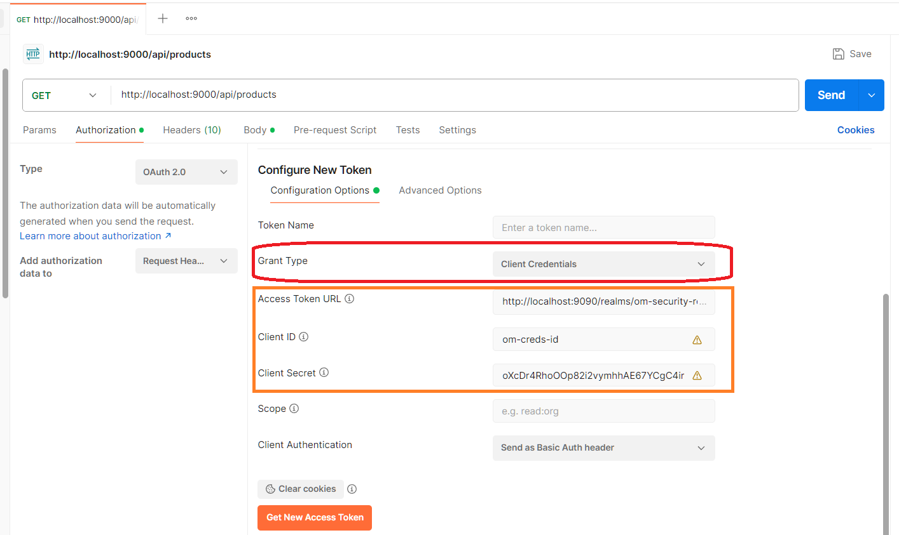
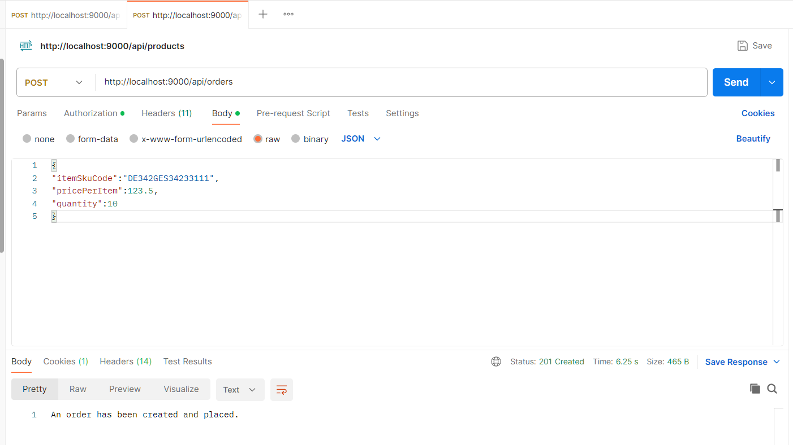

# Gateway Module
It is the gateway to Order Manager, a distributed app built with Spring Cloud Config and Spring Boot.

## Setup
- Create a new project with Spring Init. Make sure to add the two dependencies:

- Then add the code (Java code has been added, feel free to switch to Kotlin if you prefer!).

### Manual Testing and Operation, along with Keycloak Configuration
- Now sit back tight and do the dirty engineering on service endpoints, integration and parameter matching.

- Run `docker-compose up -d` out of Product, Order and Inventory services.
- Start (Run.../Debug...) Product, Order, Inventory and Gateway services with IDE or CLI.
- Hit Product service over the port of Gateway. You succeed to access the service endpoint:

- Query the Inventory database with mysql login in Docker CLI to copy or remember one SKU code:

- Test the inventory service for availability of that SKU twice- for true and for false:

- Now write (just type in or copy-and-edit or get help from AI assistant) ´docker-compose-yml´ for Keycloak and its database. And, start the containers with `docker-compose up -d`:

- When the containers have started, visit `http://localhost:9090` in a web browser, login as admin (check creds in docker-compose or secrets file) and create a new realm for your app:

- The realm should get created quickly and please you with this:

- Create client with client creds ID and capability config:

- Client creation should finish smoothly as well:

- Under credentials of the new client, Client Secret is autopopulated. It may be used as such or may well be regenerated. Either choice is good at this moment:

- Click and open the link of OpenID Endpoint Config:

- You may see a page similar to the one shown below. Copy ´issuer´ value from the page:

- Use the issuer value to make the respective registry in `application.properties` of gateway service:

- Now try to access Product (or another) service via gateway port. 401 response code must be returned:

- Check with another HTTP request sender:

- Now, to add authorization, do the following exercise:
  - In Postman (or a similar GUI tool), under Request > Authorization, go to `Configure New Token > Configuration Options`. There select `Client Credentials` against `Grant Type`.
  - Then paste into `Access Token URL` the value (the URL) of "token endoint" header which is on OpenID Endpoint Config page:

  - Copy or remember the client creds ID from client settings in Keycload Admin and paste against `Client ID` in Postman dialog:

  - Copy client secret from client credentials (Keycloak Admin) against `Client Secret` in Postman dialog:

  - Make sure that `Grant Type` is `Client Crendentials`:

  - Click on the tempting `Get New Access Token` button... finally:

  - Now the Authz is complete for you. Hurray! Enjoy accessing your favorite services via gateway, now in a secure manner :) :

  - And yes, this is a no-explainer. It's obviously obvious to click on the `Use Token` button. Doing so gets you a credit of 300 seconds to get inside on the Mission IM-Possible:

  - Product service is now secured with gateway and Keycloak:

  - Order service is also secured with Keycloak, thanks to gateway for integrating them well:

## Contact Pointers
- **LinkedIn:** <https://www.linkedin.com/in/rishirajopenminds>
- **X:** <https://twitter.com/RishiRajDevOps>
- **Start Page:** <https://bio.link/rishiraj49de>
- **GitHub:** <https://github.com/rishiraj88>

## Credits and Gratitude
I thank all who have mentored, taught and guided me. Also, I appreciate who have supported my work with pair programming and more.
