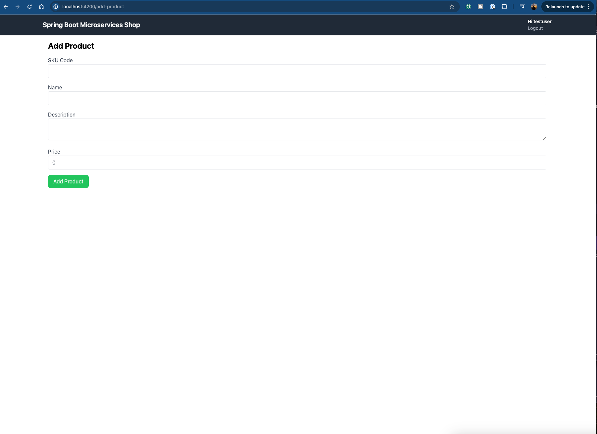

# Microservices Shop - Frontend

For order-manager, the frontend app is created, using Angular 18.0.2.

## Development server

- Run `ng serve` or `npm start` for a dev server. 
- In a web browser, navigate to `http://localhost:4200/`.

## Screenshots

Home Page

Add Product page

Refer to the detailed guide to setup the application along with Keycloak - https://programmingtechie.com/2024/06/09/spring-boot-microservices-tutorial-part-7/

## Acknowledgement
🙇I did not created this application. Gratitude to my friend and mentor for the big help here.🙏